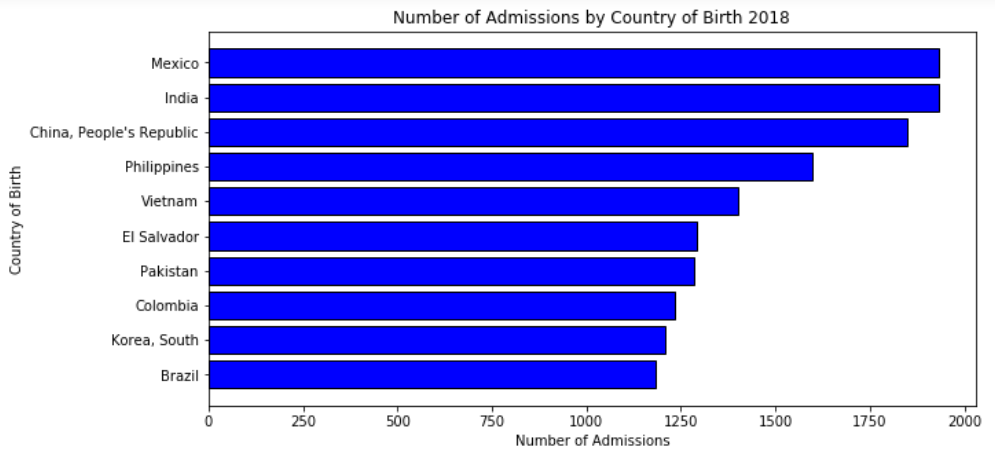

# Legal Permanent Resident (LPR) Location and Migration Pattern Analysis

## Analysis of Concentrations of Legal Permanent Residents (LPR) by Country and Class of Admission

## TABLE OF CONTENTS
* [Motivation](#motivation)
* [Data](#data)
* [Analytical Approach](#analytical-approach)
* [Tools Used](#tools-used)
* [Sources](#sources)

### MOTIVATION
Since 2013 I have transcribed immgration hearings for a company contracted to the Department of Justice (DOJ).  I primarily transcribe hearings for illegal immigrants, but I wanted to know more about where legal permanent residents (hereafter "LPR" or "LPRs") have arrived from, where they tend to settle, and changes in their migration pattern over the past decade.  I explored the following:

- Where are the top 10 largest concentrations of LPRs over the data available by A) country of birth and B) major class of admission (grouped into the six major categories, as the data contained a number of subgroups within each type)?
- How have these concentrations changed over time (data available for period 2007-2018)?

### DATA
To answer these questions, I used immigration data provided by the Department of Homeland Security over the years 2007-2018.  I hope to be able to map current county of residence using geolocation data, if available.

### ANALYTICAL APPROACH
#### Known Issues and Challenges:
- There were many entries in the `Admissions` column denoted by a `D`.  According to the DHS data website, the D indicates the number is <=3, which may result in a lack of privacy for the LPR if specified.  I replaced the `D` entries with a 1 so that the column could then be converted to an integer type for calculation purposes.  Fully deleting these rows might better represent the diversity in the data.
- The LPR tables are limited to top 200 counties by size of admission. Only state and county are listed (not city) for current LPR location.  I do not plan to add cities in at this point unless the visualization is not clear.

I created a map in Tableau showing by state/city/county where the top 10 concentrations of LPRs are located by year.  Bubble size indicates size of concentration.  I also added a few maps in Python during EDA, such as this one:

I used bar charts to show the top 10 countries of birth for LPRs by year to look at the changes in where LPRs are coming from.  These may correlate to world events or political situations and may show a trend in certain areas.

### TOOLS USED
- `Excel` -- LPR data was provided as 11 separate workbooks, which were cleaned and merged in Python.

- `Python/Pandas` - for exploration and aggregation of the data

- `Tableau` - for creating interactive dashboard

- `Visual Studio Code` for editing html/markdown files

- `Git` for version control

### SOURCES
This information was downloaded from:
- https://www.dhs.gov/immigration-statistics/readingroom/LPR/LPRcounty

Further information was found at:
- https://www.dhs.gov/immigration-statistics/lawful-permanent-residents/ImmigrantCOA
- https://www.dhs.gov/disclosure-policy-office-immigration-statistics