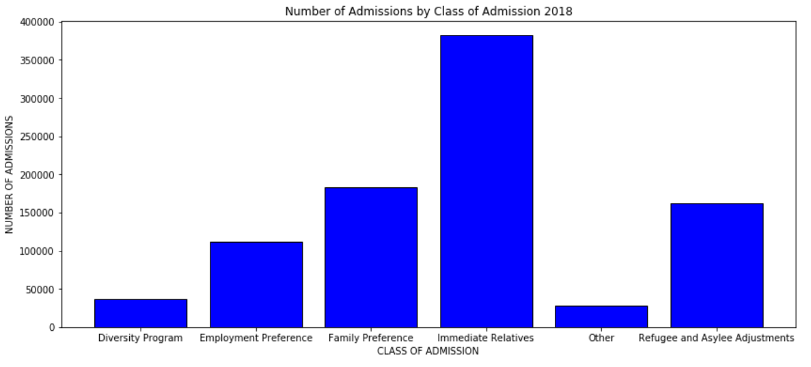

# Legal Permanent Resident (LPR) Analysis, 2007-2018

## Analysis of Legal Permanent Residents (LPR) by Country of Birth, County of Current Residence, and Class of Admission

## TABLE OF CONTENTS
* [Motivation](#motivation)
* [Data](#data)
* [Analytical Approach](#analytical-approach)
* [Tools Used](#tools-used)
* [Sources](#sources)

### MOTIVATION
Since 2013 I have transcribed immgration hearings for a company contracted to the Department of Justice (DOJ).  I primarily transcribe hearings for illegal immigrants, but I wanted to know more about where legal permanent residents (hereafter "LPR" or "LPRs") have arrived from, where they tend to settle, and changes in their migration pattern over the past decade.  I also wanted to know what class of admission they came in under and how that pattern has changed, if at all, in the same time perio.  I explored the following:

- What is the most common major class of admission (grouped into the six major categories, as the data contained a number of subgroups within each type) and how that has changed, if at all, over the period 2007-2018?
- What are the countries of birth of the top 10 of LPR admissions over the past decade? How have these concentrations changed over that time period?
- What are the top 10 counties in the U.S. in which the highest number of LPRs reside over the past decade? How have these concentrations changed, if at all, over that time period?

### DATA
To answer these questions, I used LPR immigration data provided by the Department of Homeland Security over the years 2007-2018.  This data contains birth country and U.S. county data which will be used to provide visual insights on maps.

### ANALYTICAL APPROACH
#### Known Issues and Challenges:
- There were many entries in the `Admissions` column denoted by a `D`.  According to the DHS data website, the D indicates the number is <=3, which may result in a lack of privacy for the LPR if specified.  I replaced the `D` entries with a 1 so that the column could then be converted to an integer type for calculation purposes.  Fully deleting these rows might better represent the diversity in the data.
- The LPR tables are limited to top 200 counties by size of admission. Only state and county are listed (not city) for current LPR location.  I do not plan to add cities in, as the county-level visualization seems clear. I further limited the data in the mapping to the top 10 countries or counties to provide a clear visualization.

I created a map in Tableau showing by county where the top 10 concentrations of LPRs are located by year and also a map showing the countries where the top 10 highest LPR grouped admissions were born.

I used bar and pie charts to show the top 10 countries of birth for LPRs by year to look at the changes in where LPRs are coming from.  I also created a line chart showing the fluctuations in each major class of admission.  These seem to correlate to world events or political changes (such as a change in U.S. president or political party) and may show a trend in certain areas.

### TOOLS USED
- `Excel` -- LPR data was provided as 11 separate workbooks, which were cleaned and merged in Python.

- `Python/Pandas` - for exploration and aggregation of the data

- `Tableau` - for creating interactive dashboard

- `Visual Studio Code` for editing html/markdown files

- `Git` for version control

### SOURCES
This information was downloaded from:
- https://www.dhs.gov/immigration-statistics/readingroom/LPR/LPRcounty

Further information was found at:
- https://www.dhs.gov/immigration-statistics/lawful-permanent-residents/ImmigrantCOA
- https://www.dhs.gov/disclosure-policy-office-immigration-statistics
- https://www.dhs.gov/immigration-statistics/lawful-permanent-residents/ImmigrantCOA